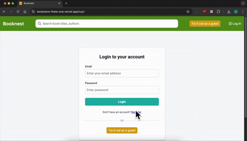
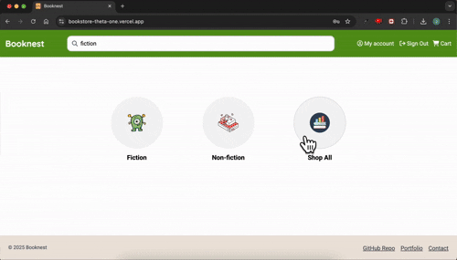
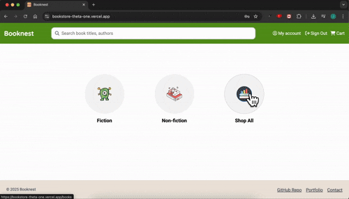
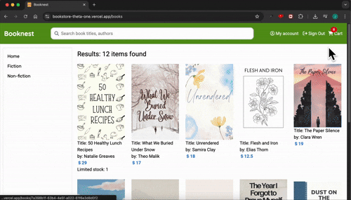

# Booknest

_This project is a work-in-progress. I’m continuously learning and improving it_

## 🎬 Demo

_Register and log in_  


_Browse and search for books_  


_Add a book to the cart_  


_View the cart and proceed to checkout_  


## Description

Booknest is a personal project — an online bookstore where users can:

- Register and log in to their accounts (Google Sign-In supported — test accounts only at this stage)

- Search for books or authors

- View detailed information about selected books

- Add books to their cart

- Pay securely via Stripe

- View past orders

## 📚 Usage Tips

- Press the "Try it out as guest" button to log in with a temporary account and try out the app.

- Use the search bar to find books by title or author.

- Hit Enter without typing to view all books in the demo database.

- The app currently includes 12 sample books, so some searches may return no results.

- The UI is responsive and works across devices.

- Add books to your cart and complete checkout using Stripe.
  To test Stripe checkout, use card number 4242 4242 4242 4242, expiry 04/29, CVC 424, and ZIP code 4242 — all values are repeating 42s.

- Click “My Account” in the top bar to view past completed orders.

## 🛠️ Tech Stack

This project is built using:

- Next.js

- TypeScript

- Tailwind CSS

- Auth.js

- Stripe API

- PostgreSQL

It includes custom API routes (via Next.js) to handle backend logic such as user authentication, book detail fetching, cart management, and payment session creation.

Frontend errors are displayed with user-friendly messages, and server-side issues are logged via `console.error`.

## 🚀 Live Demo

Deployed on [Vercel](https://bookstore-theta-one.vercel.app/)

## Installation

```bash
npm install
```

## Usage

```bash
npm run dev
```

## License

MIT

## Project status

👩🏻‍💻 **In progress**

- All major features are implemented
- Currently refining UI/UX, cleaning up code, and preparing to add tests
